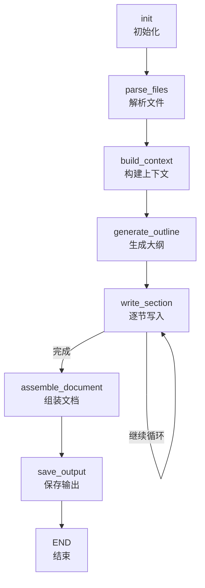

# brd-gen-agent
Business Requirements Document，业务需求规格说明书生成agent

## 工作流架构

## 工作流说明

- **init**: 初始化工作流状态
- **parse_files**: 递归解析输入目录中的文档文件（支持 PDF、DOCX、TXT 等格式）
- **build_context**: 基于解析的文件内容构建上下文
- **generate_outline**: 使用 LLM 生成需求规格说明书的详细大纲
- **write_section**: 逐节生成文档内容，支持循环生成多个章节
- **assemble_document**: 将所有章节组装成完整文档
- **save_output**: 保存生成的文档到指定位置
