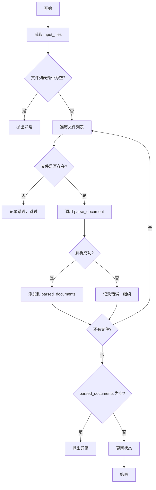

# 文件提取节点 - File Extraction Agent

## 📋 概述

`file_extraction_agent.py` 是 SRS Agent 工作流中的第一个处理节点，负责加载和解析各种格式的输入文件，将原始文件转换为统一的 `ParsedDocument` 对象。

---

## 🎯 核心功能

1. **读取输入文件列表** - 从状态中获取待处理的文件路径
2. **智能格式识别** - 根据文件扩展名自动选择合适的解析器
3. **统一接口调用** - 通过 `parse_document()` 统一入口解析文件
4. **错误容错处理** - 单个文件失败不影响其他文件的处理
5. **结构化输出** - 生成标准化的 `ParsedDocument` 对象列表

---

## 📁 文件位置

```
srs_agent/agents/file_extraction_agent.py
```

---

## 🔧 支持的文件格式

| 格式 | 扩展名 | 说明 |
|------|--------|------|
| PDF | `.pdf` | 使用 PyMuPDF (fitz) 解析 |
| Word | `.docx` | 使用 python-docx 解析 |
| Excel | `.xlsx`, `.xls` | 使用 pandas 解析 |
| PowerPoint | `.pptx`, `.ppt` | 使用 python-pptx 解析 |
| Markdown | `.md` | 直接读取文本 |
| HTML | `.html`, `.htm` | 使用 BeautifulSoup 解析 |
| 图片 | `.png`, `.jpg`, `.jpeg` | OCR 识别（待实现） |

---

## 📊 数据流

### 输入状态 (Input State)

```python
{
    'project_dir': str,           # 项目目录路径（可选）
    'input_files': List[str],     # 输入文件路径列表
    ...
}
```

### 输出状态 (Output State)

```python
{
    'parsed_documents': List[ParsedDocument],  # 解析后的文档列表
    'errors': List[str],                       # 错误信息（如果有）
    ...
}
```

### ParsedDocument 结构

```python
@dataclass
class ParsedDocument:
    file_name: str              # 文件名
    file_type: str              # 文件类型（扩展名）
    content: str                # 提取的文本内容
    metadata: Dict[str, Any]    # 元数据（可选）
```

---

## 💻 使用示例

### 在工作流中使用

```python
from langgraph import StateGraph
from agents.file_extraction_agent import file_extraction_node
from graph.state import SRSState

# 创建工作流
workflow = StateGraph(SRSState)

# 添加文件提取节点
workflow.add_node("file_extraction", file_extraction_node)

# 设置入口点
workflow.set_entry_point("file_extraction")

# 编译工作流
app = workflow.compile()

# 执行
initial_state = SRSState(
    project_dir="/path/to/project",
    input_files=[
        "requirements.pdf",
        "design.docx",
        "data.xlsx"
    ]
)

result = app.invoke(initial_state)
```

### 单独测试

```bash
cd srs_agent
python tests/test_file_extraction.py
```

---

## ⚙️ 工作流程



---

## 🛡️ 错误处理

### 1. 文件不存在
```python
# 记录错误但继续处理其他文件
state['errors'].append(f"文件不存在: {file_path}")
continue
```

### 2. 解析失败
```python
# 记录错误但继续处理其他文件
state['errors'].append(f"解析文件失败 [{file_path}]: {str(e)}")
```

### 3. 所有文件解析失败
```python
# 抛出异常，终止工作流
raise ValueError("所有文件解析失败，无可用文档")
```

---

## 📝 日志记录

节点使用了 `@log_node_execution` 装饰器，自动记录：

- ✅ 节点开始执行
- 📥 输入状态摘要
- 📤 输出状态摘要
- ⏱️ 执行耗时
- ❌ 错误信息和堆栈跟踪

日志示例：
```
10:50:25 - INFO - ▶️  开始执行节点: file_extraction_node
10:50:25 - INFO - 📥 输入状态: {"input_files": "List[3 items]", "project_dir": "str(45 chars)"}
10:50:26 - INFO - ✅ 节点执行成功 | 耗时: 0.856s
```

---

## 🔍 最佳实践

### 1. 使用绝对路径
```python
# 推荐：使用绝对路径
input_files = [
    "/absolute/path/to/document.pdf"
]

# 或者：配合 project_dir 使用相对路径
state = {
    'project_dir': '/path/to/project',
    'input_files': ['docs/requirements.pdf']
}
```

### 2. 批量处理
```python
# 可以一次性传入多个文件
state['input_files'] = [
    'requirements.pdf',
    'design.docx',
    'api_spec.md',
    'database.xlsx'
]
```

### 3. 错误检查
```python
# 执行后检查是否有错误
result = workflow.invoke(state)
if result.get('errors'):
    print("警告：部分文件解析失败")
    for error in result['errors']:
        print(f"  - {error}")
```

---

## 🧪 测试

运行测试脚本验证节点功能：

```bash
cd D:\project\brd-gen-agent\srs_agent
python tests/test_file_extraction.py
```

预期输出：
```
================================================================================
测试文件提取节点
================================================================================

✅ 文件提取成功！
   解析了 1 个文档

文档信息:
  - 文件名: test_document.md
  - 文件类型: md
  - 内容长度: 512 字符
  - 元数据: {}

内容预览: # 软件需求规格说明书 ## 1. 引言 ### 1.1 目的 本文档描述了一个用户管理系统的需求规格...

================================================================================
✅ 测试完成！
================================================================================
```

---

## 🔄 与其他节点的集成

### 前置节点
- 无（这是工作流的第一个处理节点）

### 后续节点
1. **Project Agent** - 从 `parsed_documents` 中提取项目知识
2. **Topic Agent** - 构建主题图谱
3. **其他节点** - 使用解析后的文档内容

---

## 📌 注意事项

1. **依赖安装**：确保已安装所需的解析库（pandas, python-docx, PyMuPDF 等）
2. **编码问题**：文本文件默认使用 UTF-8 编码
3. **大文件处理**：对于超大文件，可能需要优化内存使用
4. **图片 OCR**：目前图片解析功能尚未实现，需要额外配置 OCR 引擎

---

## 🚀 未来改进

- [ ] 添加异步文件处理支持
- [ ] 实现图片 OCR 功能
- [ ] 添加文件内容缓存机制
- [ ] 支持更多文件格式（如 TXT, RTF, XML 等）
- [ ] 添加文件预处理选项（如去噪、格式化等）

---

**创建时间**: 2026-06-12  
**作者**: AI Assistant  
**版本**: 1.0.0
